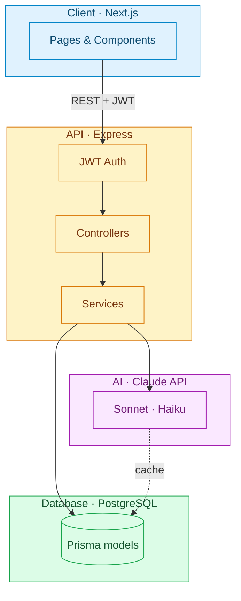

# AI Trip Planner

A full-stack web app that plans trips with AI. Tell it a destination, your travel dates, and what you're into — Claude researches current attractions, restaurants, news, and weather, then builds a complete day-by-day itinerary you can edit directly or refine through chat. Everything is saved per-user, with a bilingual (English / Chinese) UI.

## Features

- **AI-generated itineraries** — full day-by-day plans built from destination, trip length, arrival/departure date & time, interests, must-see attractions/restaurants, travel style, and budget (set via a slider, not free text)
- **Grounded in real, current information** — Claude uses the `web_search` tool to pull in current attractions/restaurant reviews, news from the last 1–2 years, and weather, and flags feasibility concerns (unrealistic pacing, seasonal closures, conflicting travel times) instead of just guessing
- **Direct editing** — check off, delete, or edit any itinerary item (time, duration, description) without regenerating the whole plan
- **Photos and map links per item** — each itinerary item can carry a photo sourced from web search and a one-click "view on Google Maps" link
- **Conversational refinement with a confirm step** — ask questions or request changes in plain language; the AI first classifies whether you're asking a question or requesting a change, and any actual change is shown as a proposal you approve or reject before it's applied — no silent edits
- **AI-suggested interest tags and quick-question prompts** — destination- and date-aware suggestions (e.g. seasonal activities that actually fall within your travel dates) so you're not starting from a blank text box
- **Trip history** — a "My Trips" page to revisit and manage past plans
- **English / Chinese UI**, including AI-generated content (summaries, feasibility notes, chat replies)

## Architecture



**How a generation request flows through the system:** the client submits the planner form to `POST /api/ai/generate`; JWT middleware authenticates the request; the backend checks a `DestinationResearch` cache (keyed by destination + locale, 14-day TTL) for reusable notes on that destination — on a cache miss, a one-time `web_search`-heavy Claude call researches and caches them; the main generation call then builds the itinerary from those cached notes plus a small `web_search` budget reserved for date-specific checks (this week's weather, an event landing on the exact travel dates); the result is persisted via Prisma (`Trip` → `ItineraryDay` → `ItineraryItem`) and returned to the client. This caching layer — a lightweight, RAG-style pattern — is what keeps repeat generations for a previously-seen destination fast and cheap instead of re-searching the same facts on every request.

Malformed or incomplete LLM output (syntactically valid JSON missing a required field, for example) is caught by a validation-and-retry loop that feeds the bad response back to Claude for correction, up to three attempts, rather than silently persisting bad data.

## Tech Stack

| Layer | Technologies |
|---|---|
| Frontend | Next.js (App Router) · TypeScript · Tailwind CSS · Context API for auth/locale state |
| Backend | Node.js · Express · TypeScript · Zod request validation · JWT + bcrypt auth |
| Database | PostgreSQL ([Neon](https://neon.tech) / [Supabase](https://supabase.com) free tier) · Prisma ORM |
| AI | Claude API (`@anthropic-ai/sdk`) · `web_search` tool · destination-research caching |
| Testing | Vitest + Supertest (backend) · Vitest + React Testing Library (frontend) |
| i18n | Flat JSON dictionaries (English/Chinese), including AI-generated content |

## Quick Start

### 1. Backend

```bash
cd backend
npm install
cp .env.example .env   # fill in DATABASE_URL, JWT_SECRET, ANTHROPIC_API_KEY
npx prisma migrate dev --name init
npm run dev             # http://localhost:4000
```

### 2. Frontend

```bash
cd frontend
npm install
cp .env.local.example .env.local   # defaults to http://localhost:4000/api
npm run dev              # http://localhost:3000
```

### Running tests

```bash
cd backend && npm test
cd frontend && npm test
```

## Project Structure

```
ai-trip-planner/
├── backend/    # Express API server
└── frontend/   # Next.js app
```
